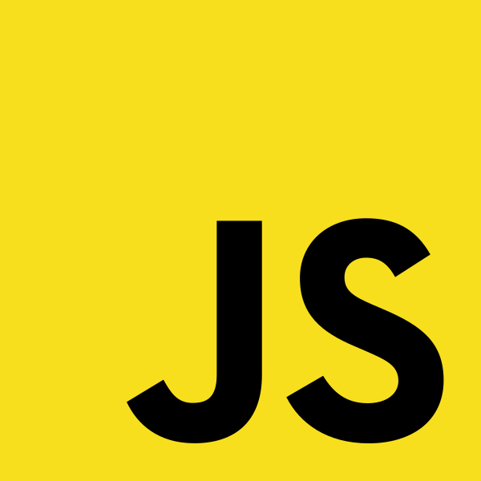

# Hello there! 

- I'm a software engineer writing code for 
- Currently working on [Visual Builder Studio](https://www.oracle.com/application-development/visual-builder-studio/), a cloud-based software development Platform as a Service (PaaS) and hosted environment for application development.
- I mostly work with vanilla JavaScript  and sometimes TypeScript .
- We use [JavaScript Extension Toolkit (JET)](https://www.oracle.com/webfolder/technetwork/jet/index.html) . Our in-house solution to develop JavaScript applications that feel and behave consistently across all devices, with [several](https://www.oracle.com/webfolder/technetwork/jet/jetCookbook.html) pre-designed web components.
- My open source focus is developing [Monkey](https://github.com/roguib/monkey), a Java implementation of the Monkey programming language, created by [Thorsten Ball](https://thorstenball.com/) in his amazing book [Writing An Interpreter In Go](https://interpreterbook.com/). The interpreter is already fully functional, and now I'm focused on creating an online playground so everyone can use it without needing to run it locally.
